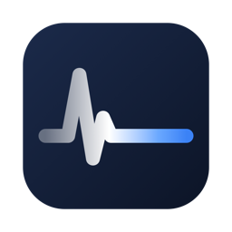

<p align="center"></p>

# Quietlink

Quietlink is a macOS menu-bar app that removes Wi-Fi lag while you game or take calls, and tells you honestly where your connection is failing.

## Why

On many Macs the Wi-Fi radio briefly leaves your network's channel to serve **AWDL** (Apple Wireless Direct Link, the radio behind AirDrop, AirPlay, Handoff, Sidecar and Universal Control). Everyday browsing never notices. Games and video calls do: you get a latency spike every few seconds.

Measured on an M-series Mac (macOS 27) with an Wi-Fi 7 mesh, 600 pings to the router:

| | AWDL on | AWDL off |
| --- | --- | --- |
| Average | 12.4 ms | 4.1 ms |
| Max | 95 ms | 17.6 ms |
| Spikes > 30 ms | 77 (every ~3.6 s) | 0 |

Turning AWDL off by hand (`sudo ifconfig awdl0 down`) helps, but macOS turns it back on within seconds, and you lose AirDrop until you remember to turn it back on. Quietlink does that for you, only while it matters.

## What it does

- **Quiet mode**: holds `awdl0` down while a configured game or call is running, re-applies it every second (macOS keeps re-enabling it) and restores it when you're done. AirDrop keeps working the rest of the time, including in game lobbies.
- **Triggers**: game presets (League of Legends matches only, not the client), a Zoom meeting, call apps while an input device is active, any running app you pick, a manual or timed switch, and an optional "any input device running" heuristic for browser calls.
- **Allow AirDrop for 2 min** in the middle of a session, and **Restore AirDrop now** as an emergency stop.
- **Network monitor**: pings the router (and optionally an external host and mesh nodes) using its own ICMP prober with exact per-probe accounting. It shows ping, jitter, loss, late replies and interruptions (≥ 2 consecutive probes lost), with the live router ping in the menu bar.
- **Menu bar**: a fixed-width item showing router ping and what your Mac is sending and receiving right now (Mb/s, upload over download). A pill marks quiet mode.
- **Wi-Fi inspector**: band, channel, width, signal, noise and reported PHY rate, read from the current association without scanning. If you've connected on 6 GHz on this network before and are now on 5 GHz, it offers a one-click reconnect.
- **Quiet test**: a 4-minute A/B measurement of your own network, alternating baseline and quiet mode.
- **Sessions**: per game or call, a p50/p95/max summary, interruption count and AWDL re-enable count.
- **Explain cuts (experimental, off by default)**: reads a narrow slice of the system Wi-Fi log and notes whether a scan or AWDL activity was logged near each cut. It reports coincidence, never cause.
- Also: notifications (rate-limited), a redacted Markdown diagnostics export, a `quietlink` CLI (`status`, `on [minutes]`, `off`, `pause`, `resume`, `test`), English and Spanish, and light and dark mode.

Quietlink never scans for Wi-Fi networks, because scanning is itself one of the things that causes cuts.

## How it works

- **Menu-bar app**: [Electrobun](https://electrobun.dev) (Bun + system WebKit) with a Svelte 5 UI. The domain logic is pure TypeScript: leases, the mode reducer, probe accounting, the Quiet test and the band advisor.
- **`quietlink-helper`**: a small Swift binary with two modes. It also draws the menu-bar item natively, so macOS tints it for light and dark menu bars.
  - **Sensor mode**: reports processes, input devices, Wi-Fi, router, sleep/wake and ICMP probes as JSON lines.
  - **Warden mode**: a user LaunchAgent and the *only* part of Quietlink that runs privileged commands. The app holds a dead-man lease on it and renews it every second. If the app crashes, hangs or is suspended, the warden turns AWDL back on within about 5 s. Its own state is persisted before every change, and it recovers after its own crashes.

## Privileges

Quietlink asks for your password once, to install this rule as `/etc/sudoers.d/quietlink-<you>` (validated with `visudo`):

```
<you> ALL=(root) NOPASSWD: /sbin/ifconfig awdl0 down, /sbin/ifconfig awdl0 up
```

That is the entire root surface: two exact commands, no wildcards, and no daemon running as root. **Any process running as your user can also run those two commands.** At worst, something could turn AirDrop off or on. Within Quietlink only the warden runs them. Settings → Permissions → Uninstall removes the rule and the warden.

## Privacy

- Everything stays on your Mac. There is no telemetry. The only network traffic Quietlink creates is ICMP probes to your router and to the targets you configure (`1.1.1.1` by default; you can clear it), plus one daily request to GitHub's public API to look for a new release (can be turned off).
- Per-second samples and events are kept 24 h, sessions 30 days. Settings → Data → Clear all data deletes them.
- Quietlink never stores SSIDs, BSSIDs, raw log lines, command lines or audio. Networks are told apart by a keyed hash of the router's MAC address.
- Diagnostics exports are redacted by default (user name, home paths, IP and MAC addresses, targets).

## Install

1. Download `Quietlink-<version>-macos-arm64.zip` from [Releases](https://github.com/Ionmi/quietlink/releases) and unzip it.
2. Move `Quietlink.app` to `/Applications`.
3. The first time, right-click it and choose **Open**: releases aren't signed with an Apple Developer ID, so macOS asks for confirmation once. (Alternatively: `xattr -dr com.apple.quarantine /Applications/Quietlink.app`.)
4. Open the menu-bar panel → Settings → Permissions → **Allow…**

## Updates

Quietlink checks GitHub for a newer release at launch and once a day (Settings → About; can be turned off). When there is one, **Install and restart** downloads it from this repository's releases, checks its SHA-256 and bundle id, swaps it into place (the old version goes to the Trash) and relaunches. Settings and permissions are kept.

Releases are ad-hoc signed and not notarized, by design: the project doesn't use a paid Apple Developer ID. That's also why firewalls like LuLu ask again after each update.

Maintainers: bump `version` in `package.json`, commit, then push a tag `vX.Y.Z`. The Release workflow checks the tag, runs the tests, builds and publishes the zip with its SHA-256.

## Build from source

Requirements: macOS 14+, [Bun](https://bun.sh) 1.4+, Xcode Command Line Tools (`xcode-select --install`).

```sh
bun install
bunx electrobun prepare
bun run build        # Swift helper, views, icons, app bundle
bun run start
```

Tests: `bun test` (domain, adapters, controller), `bun run test:helper` (warden core + sensor self-test), `bun run test:integration` (warden in dry-run: leases, crash recovery, SIGTERM, hang watchdog).

If you use a firewall such as LuLu or Little Snitch, allow `quietlink-helper` to send ICMP. Otherwise Quietlink shows "all probes are failing". Because releases aren't Developer ID signed, the firewall asks again after each update.

## Resource use

Measured on Apple Silicon: the app uses about 73 MB and under 1.5 % of one core, the sensor helper 17 MB and under 2 %, the warden 4 MB and practically nothing.

## Support

Verified on macOS 27 on Apple Silicon. Other macOS 14+ versions and Intel Macs should work but are untested. The unified-log parser for "Explain cuts" is enabled only for macOS versions with test fixtures (27).

## Limitations

- Holding AWDL down with a 1-second loop *reduces* AWDL activity. It cannot stop macOS from using it for a moment between checks.
- Other causes of cuts (firmware scans, roaming, a weak link, the ISP) are measured, not fixed.
- Releases are ad-hoc signed and not notarized (no paid Apple Developer ID), so macOS asks for confirmation on first launch.

## Uninstall

1. Settings → Permissions → **Uninstall** (restores AWDL, removes the warden and the sudoers rule).
2. Quit Quietlink and delete the app.
3. Remove `~/Library/Application Support/Quietlink` and, if present, `~/Library/LaunchAgents/dev.quietlink.login.plist` and `~/.local/bin/quietlink`.

## License

MIT
